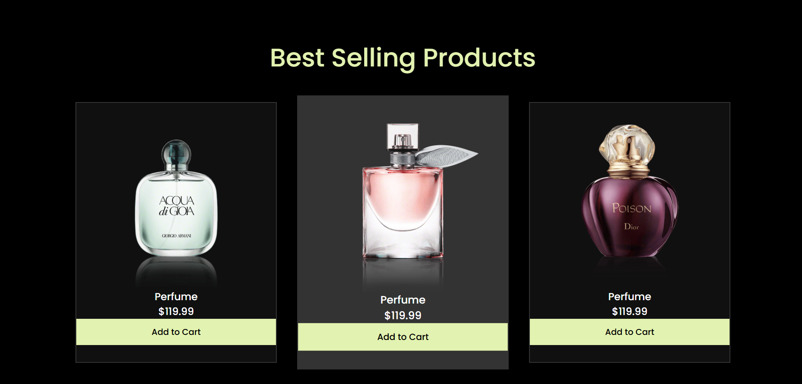
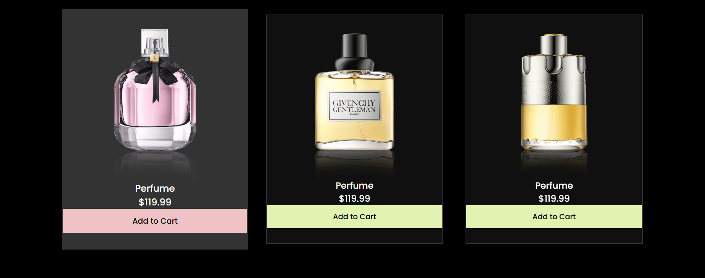
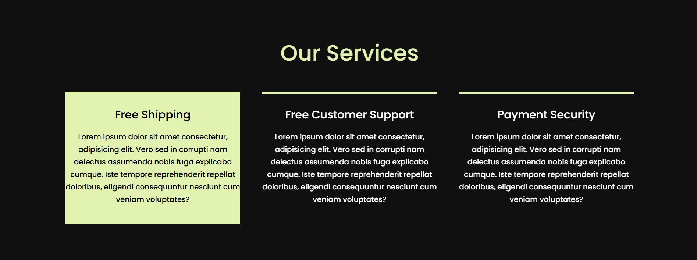
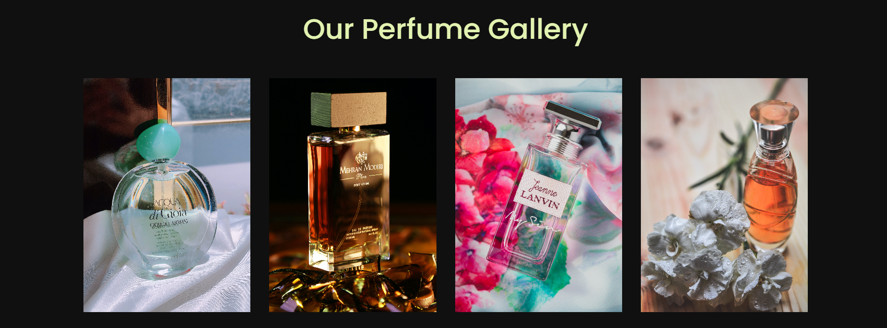
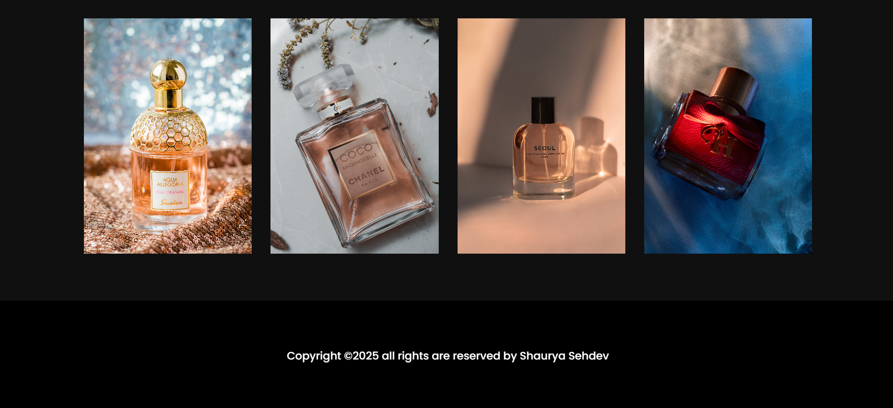

# 🌸 Perfume Landing Page

A stylish, responsive landing page for a perfume brand built using **HTML**, **CSS**, and **JavaScript** — featuring animations, scroll effects, and elegant visuals.

---

## ✨ Features

- Responsive navbar with hamburger toggle
- Hero section with glowing circle background
- Animated horizontal scrolling banner
- Product showcase with hover zoom effect
- Stylish services section with animation on hover
- Promotional sale section with glow background
- Modern image gallery with grid layout
- Mobile-first responsive layout
- Custom CSS variables for color management

---

## 🖼️ Screenshots

### 💎 Hero Section


---

### 🌸 Scrolling Banner


---

### 🧴 Product Showcase


---

### ✨ Hover Cards



---

### 🔥 Sale Section



---

### 📸 Gallery Section



---

### 📱 Mobile View – Hamburger Menu


---

### 📱 Mobile View – Hero



---

### 📱 Mobile View – Product Grid



---

## 🚀 How to Use

### 1. Clone the Repository

```bash
git clone https://github.com/yourusername/perfume-landing-page.git
cd perfume-landing-page

---
# 2. Open in Editor
bash
Copy
Edit
code .
### 3. Launch the Website
Double click on index.html or use a Live Server extension in VS Code.

---

### 🧱 Folder Structure
markdown
Copy
Edit
project1/
│
├── index.html
├── style.css
├── script.js
└── screenshots1/
    ├── first.png
    ├── second.png
    ├── third.png
    ├── fourth.png
    ├── fifth.png
    ├── sixth.png
    ├── seventh.png
    ├── eighth.png
    └── ninth.png

    ---

### 🧑‍💻 Author
Shaurya Sehdev
Frontend Developer


If you found this useful or interesting, feel free to ⭐ star the repository.

yaml
Copy
Edit

---

Let me know if you want this saved into a file or need alternate image names.


```
